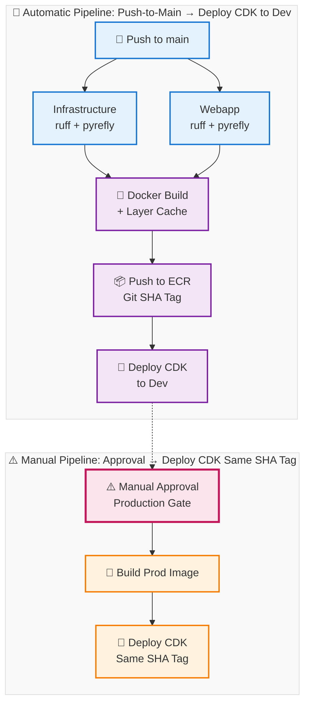

# Simple CI/CD Pipeline - Mermaid Diagram

## Key Pipeline Steps

1. **QA Checks** - Parallel matrix for infrastructure and webapp
2. **Build & Deploy** - Docker build with caching, push to dev ECR, deploy to development
3. **Manual Approval** - Production gate requiring human approval
4. **Deploy Prod** - Build production image, deploy with same git SHA tag

## Reusable Actions
- setup-environment
- build-push-image
- deploy-cdk
- run-qa

